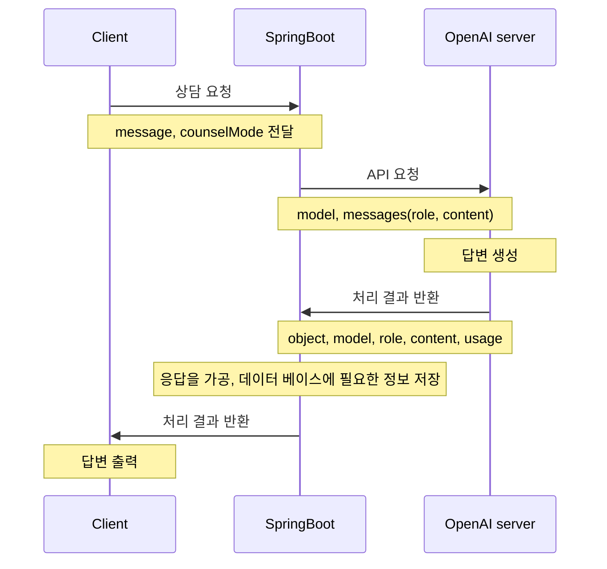
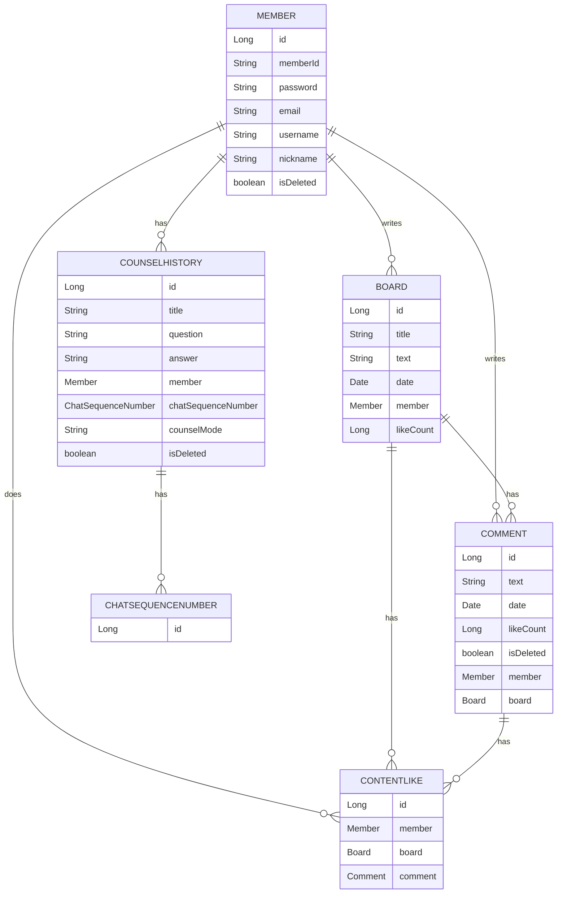

# AI-Counseler
> Open AI API를 이용한 고민상담 웹 애플리케이션

배포 주소 : http://13.124.231.241:8080

<br />

## ✅ 개요
- 본 애플리케이션은 Open AI API를 활용하여 개발하였습니다.
- 사용자들의 말 못 할 고민을 AI에게 자유롭게 털어놓고 상담을 받을 수 있는 웹 애플리케이션입니다.

<br />

## ✅ 기능
- 사용자는 입력창을 통해 고민을 입력하고, Open AI 서버로부터 답변을 받을 수 있습니다.
- 사용자는 채팅을 하듯 AI와 대화를 이어나갈 수 있습니다.
- 사용자는 '상담 내역' 섹션에서 과거의 상담 기록을 관리할 수 있습니다.
- 사용자는 과거의 상담 내역으로부터 대화를 다시 이어나갈 수 있습니다.
- 사용자는 게시판에 자신의 고민을 공유할 수 있습니다.
- 사용자는 댓글을 작성할 수 있으며 게시글과 댓글에 좋아요를 남길 수 있습니다.

  <br />

## ✅ 시작하기
### 사전요구 사항
 - Java JDK 11 버전이 설치되어 있어야 합니다.
 - 스프링 부트 2.7.14 버전을 사용합니다
 - H2 데이터베이스를 사용합니다.

### 설치 및 실행
> 1. 깃허브에서 프로젝트를 클론합니다.
```javascript
git clone https://github.com/KHEN-ROE/AI-Counseler.git
```

<br />

> 2. H2에서 counsel 데이터베이스를 생성합니다. application.yml에서 데이터베이스, JPA에 관한 설정을 추가합니다.
```javascript
spring:
  datasource:
    url: jdbc:h2:tcp://localhost/~/counsel
    username: sa
    password:
    driver-class-name: org.h2.Driver

  jpa:
    hibernate:
      ddl-auto: create
    properties:
      hibernate:
        format_sql: true
        use_sql_comments: true
```

<br />

> 3. Open AI API key를 발급받아서 아래와 같이 application.yml에 아래와 같이 작성합니다.
```javascript
gpt:
  token:{YOUR_OPENAI_KEY}
```

<br />

> 4. AI에게 역할을 부여할 prompt를 application.yml에 작성해야 합니다.
```javascript
prompts:
  prompt1:

  prompt2:

  prompt3:
```

<br />

## ✅ 클래스 다이어그램


<br />

## ✅ ERD


<br />

## ✅ 사용된 기술

> BE
- Spring Boot, Gradle, IntelliJ
- Interceptor 이용하여 사용자 인증
- Spring Data JPA 활용하여 데이터베이스 연동
- Validation
- Docker, AWS EC2 활용하여 배포

> FE
- Thymeleaf

<br />

## ✅ 개발자 정보
 - Name : 노우권
 - Email: shdnrnjs@gmail.com
 - Github : http://github.com/KHEN-ROE

<br />
 
 ## ✅ 기여방법
  - 버그나 기능 개선 제안은 이슈로 등록해주세요.
